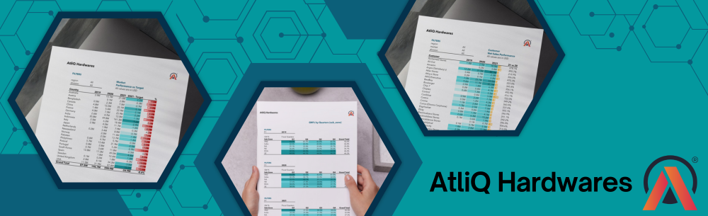

# AtliQ Hardwares Data Analytics in Excel 📊🖱️🖥

Welcome to my first Excel project in Data Analysis for Atliq Hardware! This repository showcases the work I’ve completed to analyze sales and financial data for Atliq Hardware, a leading company in the electronic hardware industry. The goal of this project was to generate insightful reports that can help in making informed business decisions to boost sales, improve profit margins, and align financial planning with strategic goals.

## Project Overview 🚀 

The primary objective of this project was to create two critical reports:
 

  **1. Sales Report** - Analyzing the sales activities and performance across different regions and product categories.

  **2. Financial Report** - Evaluating the financial health and profitability of AtliQ Hardware.
  
These reports were designed to assist stakeholders in making data-driven decisions to optimize business operations.

## Table of Contents

- [Project Overview](#overview)
- [Data Source](#data)
- [Tools & Techniques](#tools)
- [Data Cleaning & Preparation](#datacleaning)
- [Exploratory Data Analysis](#eda)
- [Data Analysis](#analysis)
- [Key Findings](#findings)
- [Recommendations](#recommendations)
- [My Learnings](#learnings)
- [Acknowledgements](#acknowledgements)
  

## Data Source 🔍 

The data used in this project was provided as part of the project instructions and included detailed sales and financial information for AtliQ Hardware. The dataset included over half a million records of sales data and was structured in multiple Excel sheets, encompassing various aspects of the business operations.

## Tools & Techniques 🛠️ 

 - **Microsoft Excel:** The primary tool used for data analysis, visualization, and reporting.
 - **Pivot Tables & Power Query:** Utilized for summarizing and visualizing data.
 - **Conditional Formatting:** Applied to highlight key data points and trends.
 - **Formulas and Functions:** Leveraged advanced Excel functions such as `SUMIF`, `VLOOKUP`, `IFERROR`, and others to perform complex calculations.

## Data Cleaning & Preparation 🕵️‍♀️ 
In the initial data preparation phase, I performed the following tasks: 

### 🧹 Data Cleaning: 

Ensured that the data was accurate, complete, and ready for analysis.
 - No missing values
 - No errors/ #na in columns
 - No spelling mistakes
 - All dim tables contain a unique column

### 🔧 Data Transformation:

 - Structured the data to facilitate easier analysis using Power Query.
 - Merged data using Left Join between tables.
 - Created new columns using DAX measures for calculated fields.

## Exploratory Data Analysis (EDA) 👩🏻‍💻 

EDA involved exploring the sales data to answer key questions for the following reports: 

### 📈 1. Sales Report:
 -  Create a _[Customer Performance Report](https://github.com/sashfaq911/Atliq-Hardwares-Excel-Data-Analytics/blob/Projects/Sales%20Analytics/Customer%20Performance%20Report.pdf)_ to show the net sales of individual customers for the year 2019- 2021 and as well as a comparison of year 2021 and 2020.
 -  Conduct a comprehensive comparison between _[market (countries) performance and sales target](https://github.com/sashfaq911/Atliq-Hardwares-Excel-Data-Analytics/blob/Projects/Sales%20Analytics/Market%20Performance%20vs%20Target%20Report.pdf)_ for 2019-2021.

_**Additional Requests:**_
 -  Find the top _[10 products based on the percentage increase](https://github.com/sashfaq911/Atliq-Hardwares-Excel-Data-Analytics/blob/Projects/Sales%20Analytics/Top%2010%20Products.pdf)_ in their net sales from 2020 to 2021?
 -  Generate a _["Division"](https://github.com/sashfaq911/Atliq-Hardwares-Excel-Data-Analytics/blob/Projects/Sales%20Analytics/Division%20Level%20Report.pdf)_ report to present the net sales data for 2020 and 2021, along with the growth percentage.
 -  Create a report that ranks the _[top 5 and bottom 5 products](https://github.com/sashfaq911/Atliq-Hardwares-Excel-Data-Analytics/blob/Projects/Sales%20Analytics/Top%20%26%20Bottom%205%20Products.pdf)_ in terms of quantity sold.
 -  What are the _[new products](https://github.com/sashfaq911/Atliq-Hardwares-Excel-Data-Analytics/blob/Projects/Sales%20Analytics/New%20Products%202021.pdf)_ that AtliQ began selling in 2021?
 -  What are the _[top 5 countries](https://github.com/sashfaq911/Atliq-Hardwares-Excel-Data-Analytics/blob/Projects/Sales%20Analytics/Top%205%20Country%202021.pdf)_ in terms of net sales in 2021?

### 🏦 2. Finance Report:
 -  Create Profit and Loss (P&L) report by _[Fiscal Year](https://github.com/sashfaq911/Atliq-Hardwares-Excel-Data-Analytics/blob/Projects/Finance%20Analytics/P%26L%20Statement%20By%20Fiscal%20Year.pdf)_ & _[Months](https://github.com/sashfaq911/Atliq-Hardwares-Excel-Data-Analytics/blob/Projects/Finance%20Analytics/P%26L%20Statement%20by%20Months%20.pdf)_
 -  Create a Profit and Loss (P&L) report by _[Markets](https://github.com/sashfaq911/Atliq-Hardwares-Excel-Data-Analytics/blob/Projects/Finance%20Analytics/P%26L%20Statement%20by%20Markets.pdf)_
 -  Create a _[GM% by Quarters](https://github.com/sashfaq911/Atliq-Hardwares-Excel-Data-Analytics/blob/Projects/Finance%20Analytics/GM%25%20by%20Quarters%20(sub%20zone).pdf)_ report in the sub zone division for each of the years from 2019-2021.

## Data Analysis 📶 

Some interesting Excel features I worked with while creating the reports:

### 📈 1. Sales Report Creation
---

**Customer Performance Report**
- Developed pivot tables to visualize sales data and provide insights.
- Applied `CALCULATE()` to filter Net Sales for year 2019, 2020, 2021. With that, used `DIVIDE()` to get '21 vs 20' column.
- Once all measures were created, I formatted numbers to _millions with one decimal place_ using `0.0,,"M"` for easy readability.
- Added text and color formatting using **Conditional Formatting & Color Bars** to highlight data, identify trends and improve data readability.

**Market Performance vs Target Report**
- Added Target Data to my existing Data Model
- Created new measures `2021 - Target` & `%` and applied same number formatting to display numbers in _millions with one decimal place_.
- Applied **3-Color-Scale Formatting**, where strongest color represeted the minimum value (our values were all negative).

With the above two reports, I generated further reports that helped me answer the business queries listed in the EDA section above:
1. [Top 10 Products 20 vs 21](https://github.com/sashfaq911/Atliq-Hardwares-Excel-Data-Analytics/blob/Projects/Sales%20Analytics/Top%2010%20Products.pdf)
2. [Division Level Report](https://github.com/sashfaq911/Atliq-Hardwares-Excel-Data-Analytics/blob/Projects/Sales%20Analytics/Division%20Level%20Report.pdf)
3. [Top & Bottom 5 Products By QTY](https://github.com/sashfaq911/Atliq-Hardwares-Excel-Data-Analytics/blob/Projects/Sales%20Analytics/Top%20%26%20Bottom%205%20Products.pdf)
4. [New Products Sold 2021](https://github.com/sashfaq911/Atliq-Hardwares-Excel-Data-Analytics/blob/Projects/Sales%20Analytics/New%20Products%202021.pdf)
5. [Top 5 Countries by Net Sales 2021](https://github.com/sashfaq911/Atliq-Hardwares-Excel-Data-Analytics/blob/Projects/Sales%20Analytics/Top%205%20Country%202021.pdf)

### 📊 2. Financial Report Creation
---

 - Generated P&L (profit and loss) reports to assess the financial performance of AtliQ Hardware over year, month, and markets.
 - Determined AtliQ's _Fiscal Year_ (12-month period from September 1st to August 31st) to compute Net Sales correctly.
 - Used critical metrics such as COGS, Gross Margin, GM% to evaluate AtliQ’s financial performance, profitability, and pricing tactics over the past three years and perfromed a comparable '21 vs 20'.

**P & L By Fiscal Year**

| Metrics | 21 vs 20 |
|-------- | -------- |
| Net Sales | 204.5% |
| COGS | 208.6% |
| Gross Margin | 197.6% |
| GM % | -2.3% |

## Key Findings 🔑 
The analysis results are summarized as follows: 

1. 📈 **Sales Growth**: AtliQ Hardwares experienced significant growth from 2020 to 2021, with net sales increasing by 204.5% (from $196.7M to $598.9M).

2. 🌎 **Top Performing Markets**: 
   - India ($161.3M)
   - USA ($87.8M)
   - South Korea ($49.0M)

3. 🖥️ **Product Performance**: 
   - Top product: AQ Electron 4 3600 Desktop Processor (541.3% growth from 2020 to 2021)
   - New products introduced in 2021 generated $176.2M in sales

4. 🛒 **Customer Insights**: 
   - Amazon was the top customer in 2021 ($82.1M)
   - Acclaimed Stores showed the highest growth (378.1%)

5. 💰 **Gross Margin**: Overall GM% decreased slightly from 37.3% in 2020 to 36.4% in 2021

6. 🌏 **Regional Performance**: 
   - ANZ (Australia/New Zealand) consistently maintained the highest GM% across 2019-2021
   - India showed lower but stable GM% around 32%

## Recommendations 💡 
Based on the analysis, I recommend the following actions: 

1. 🚀 **Expand in High-Growth Markets**: Focus on expanding operations in markets like India, USA, and South Korea, which show strong sales performance.

2. 📊 **Product Strategy**: 
   - Continue investing in successful product lines like the AQ Electron series
   - Maintain focus on new product development, given the success of 2021 launches

3. 🤝 **Customer Relationships**: 
   - Strengthen partnerships with top-performing customers like Amazon
   - Analyze and replicate strategies used with high-growth customers like Acclaimed Stores

4. 📈 **Profit Margin Improvement**: 
   - Investigate reasons for the slight decrease in overall GM% and implement strategies to improve it
   - Learn from the ANZ region's practices to improve GM% in other regions, especially India

5. ⛓️ **Supply Chain Optimization**: Given the significant sales growth, ensure the supply chain can keep up with increased demand to maintain customer satisfaction

## My Learnings 🧑‍🎓 
This Excel project enabled me to gain both technical and soft skills. Here is a quick breakdown of what I learned:

### 🧑‍🔧 Technical Skills:
**Excel Proficiency -** Gained a deeper understanding of Excel, including ETL (Extract, Transform, Load), DAX functions, pivot tables, and data visualization techniques.

- [x]	**Data Analysis:** Developed the ability to clean, transform, and analyze data to extract meaningful insights.
- [x] **Data Modeling:** Connecting Tables Using Star Schema methodology in Power Query, Adding Date Table, Fiscal Year Columns
- [x]	**Empathetic Report Creation:** Learned to create user-centric reports that are comprehensive and empathetic to effectively communicate analysis of results.

### 🙋🏻‍♀️ Soft Skills:
- [x]	**Attention to Detail:** Ensured accuracy and precision in data handling and report generation through fine-tuning.
- [x]	**Problem-Solving Mindset:** Tackled challenges related to data inconsistencies and reporting requirements, breaking down complex problems into smaller solvable chunks.
- [x]	**Functional Knowledge:** Thorough understanding of Sales & Finance Reports.

## Acknowledgements 🙏 

A special thanks to [Dhaval Patel](https://www.linkedin.com/in/dhavalsays/) and [Hemanand Vadivel](https://www.linkedin.com/in/hemvad/) for their guidance through the [CodeBasics Data Analysis BootCamp 3.0](https://codebasics.io/bootcamps/data-analytics-bootcamp-with-practical-job-assistance). This project has been an invaluable learning experience and a key milestone in my data analytics journey!

## Support ❤️ 

Contributions, issues, and suggestions are welcome!

Give a ⭐️ if you like this project!
